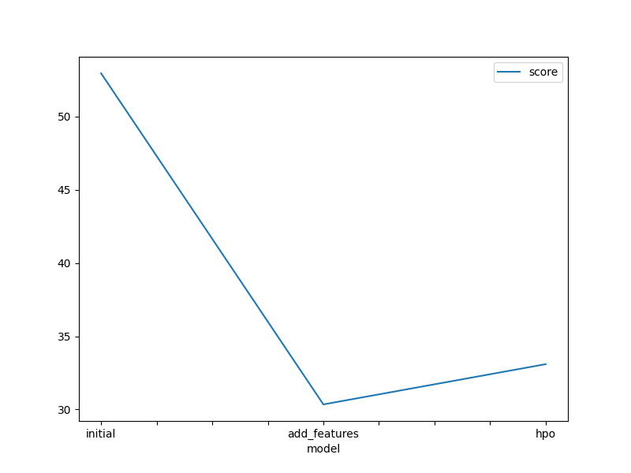
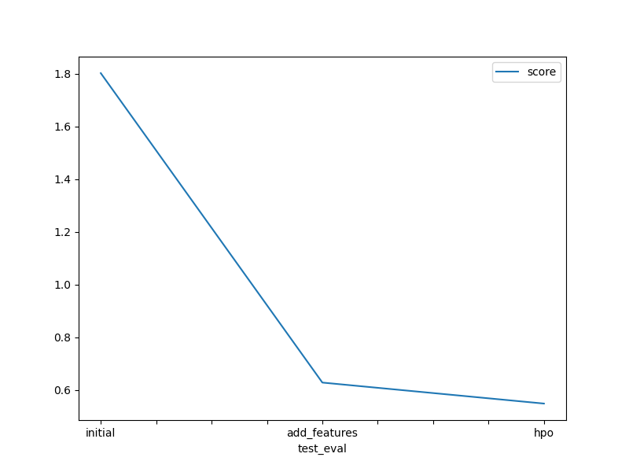

# Report: Predict Bike Sharing Demand with AutoGluon Solution
#### John Aziz

## Initial Training
### What did you realize when you tried to submit your predictions? What changes were needed to the output of the predictor to submit your results?
Removing negative values by checking the numbers lower than 0 in the count column and setting them to 0 instead of the negative number.

### What was the top ranked model that performed?
WeightedEnsemble_L3 with feature selection and optimization.
WeightedEnsemble_L2 with hyperparamter tuning.

## Exploratory data analysis and feature creation
### What did the exploratory analysis find and how did you add additional features?
splitting the datetime column into 4 different columns: year, month, day, hour.

### How much better did your model preform after adding additional features and why do you think that is?
It performed 3 times better than the original model because we told the model to treat categorigal columns as category not integers which makes the model understand and deal with the data in a better way in addition to that we increased the number of feature to learn from.

## Hyper parameter tuning
### How much better did your model preform after trying different hyper parameters?
a little better than orignal models the difference was 0.1.

### If you were given more time with this dataset, where do you think you would spend more time?
Understanding how each column in the date affects the count that we need to predict and finding correlation between the data and the target label to better select the features that contribute in defining our target.

### Create a table with the models you ran, the hyperparameters modified, and the kaggle score.
model|hpo1|hpo2|hpo3|score|
|--|--|--|--|--|
|initial|default|default|default|1.80169|
|add_features|default|default|default|0.62780|
|hpo|CAT: Number of iterations 20000|NN: Dropout Probability between 0.0 and 0.6|GBM: Number of Leaves between 20 and 80|0.54816|

### Create a line plot showing the top model score for the three (or more) training runs during the project.

DONE: Replace the image below with your own.

### Create a line plot showing the top kaggle score for the three (or more) prediction submissions during the project.

DONE: Replace the image below with your own.

## Summary
I have explored 3 different ways to build the models:
* the first is by using the default dataset, model configuration.
* the second is by altering the data a littel bit and see how it affects the model.
* the third is by using the altered data and tuning the model hyperparamters to see how they affect the model output.